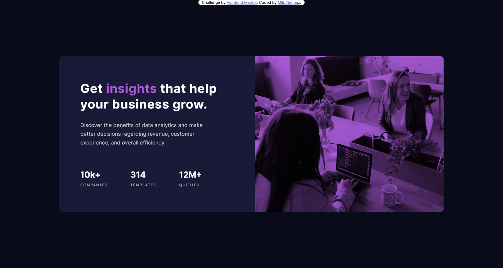

# Frontend Mentor - Stats preview card component solution

This is a solution to the [Stats preview card component challenge on Frontend Mentor](https://www.frontendmentor.io/challenges/stats-preview-card-component-8JqbgoU62). Frontend Mentor challenges help you improve your coding skills by building realistic projects. 

## Table of contents

- [Overview](#overview)
  - [The challenge](#the-challenge)
  - [Screenshot](#screenshot)
  - [Links](#links)
- [My process](#my-process)
  - [Built with](#built-with)
  - [What I learned](#what-i-learned)
- [Author](#author)


**Note: Delete this note and update the table of contents based on what sections you keep.**

## Overview

### The challenge

Users should be able to:

- View the optimal layout depending on their device's screen size

### Screenshot




### Links

- Solution URL: [My solution](https://polec4t.github.io/challenge-4-stats_preview_card_components/)

## My process

### Built with

- Semantic HTML5 markup
- CSS custom properties
- Flexbox
- position absolute / relative

### What I learned

I learned how to reverse elements of a display flex : 

```css
main {
    flex-direction: column-reverse;
  }
```


## Author

- Frontend Mentor - [@POLEC4T](https://www.frontendmentor.io/profile/POLEC4T)
